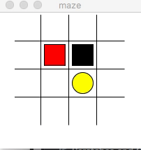

# Reinforcement Learning - Deep Q-Learning Network
Contributer: [Tian Qi](https://github.com/tqi2), [Nan Lin](https://github.com/nanlin7)


Solve maze problem using Deep Q Network

## Overview

This is the final project for Reinforcement Learning course at USF. The problem we are solving is to train an agent to learn the correct route through a maze using Deep Q Network.

## Dependencies

Building the maze environment is not the core of this course, we modified the [lvidarte](https://github.com/lvidarte/maze) and [Derek Vidovic](http://new.math.uiuc.edu/math198/MA198-2012/vidovic2/python/Maze.py) scripts which were built under *Tkinter* to make the specific environment for our problem. You also need numpy, pandas, tensorflow (1.0-1.2) and Python 3.6 to run this project

## Usage

First move to the project folder:

```bash
$ cd rl-final-project
```

run the program using the main script

```bash
$ python main.py
```

## Results

Unlike supervised learning, Reinforcement Learning can be hard for training. At first, the agent was unable to learn the correct path with common hyperparameters like 0.01 learning rate, 0.9 exploration factor. One potential reason can be the space and available states are limited and the agent was keeping getting negative penalty feedback. The cumulative negative feedback can hurt our training feedback loop and make it slower to find the correct way. Some research was done to prove too many negative feedbacks at the beginning of training is not desirable for deep network training. To tackle this issue, we iterated on parameter tuning. We conclude smaller learning rate and higher exploration factor help DQN converge faster and successfully at 80% of times.



